# PMark2 시스템 아키텍처

## 📋 개요

PMark2는 설비관리 시스템을 위한 자연어 기반 AI 작업요청 생성 어시스턴트입니다. 이 문서는 시스템의 전체 아키텍처, 모듈별 작동 흐름, 그리고 모듈 간 연계를 설명합니다.

## 🏗️ 전체 시스템 아키텍처

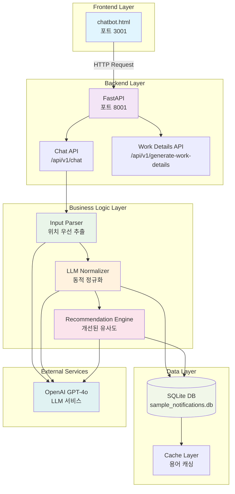

## 🔄 서비스 흐름 다이어그램

### 1. 사용자 입력 처리 흐름

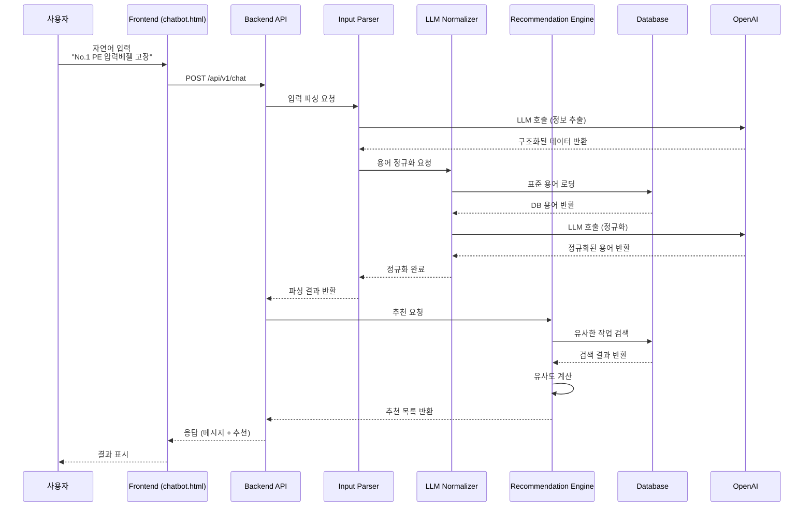

### 2. 위치 기반 검색 흐름

```mermaid
flowchart TD
    A[사용자 입력] --> B{시나리오 판단}
    B -->|S1: 자연어| C[위치 정보 우선 추출]
    B -->|S2: ITEMNO| D[ITEMNO 조회]
    
    C --> E[LLM 정보 추출]
    E --> F[위치 정규화]
    F --> G[설비유형 정규화]
    G --> H[현상코드 정규화]
    H --> I[우선순위 정규화]
    
    I --> J[위치 기반 DB 검색]
    J --> K{위치 매칭 결과}
    K -->|높은 매칭| L[위치 우선 정렬]
    K -->|낮은 매칭| M[전체 필드 검색]
    
    L --> N[유사도 계산]
    M --> N
    N --> O[임계값 필터링<br/>(>0.2)]
    O --> P[결과 반환]
    
    D --> Q[ITEMNO 검색]
    Q --> R[작업 상세 반환]
    
    style C fill:#e8f5e8
    style J fill:#e8f5e8
    style L fill:#e8f5e8
```

### 3. 유사도 계산 프로세스

```mermaid
flowchart LR
    A[입력 데이터] --> B[설비유형 매칭<br/>가중치: 35%]
    A --> C[위치 매칭<br/>가중치: 35%]
    A --> D[현상코드 매칭<br/>가중치: 20%]
    A --> E[우선순위 매칭<br/>가중치: 10%]
    
    B --> F[Levenshtein 거리 계산]
    C --> F
    D --> F
    E --> F
    
    F --> G[가중 평균 계산]
    G --> H{모든 필드<br/>높은 매칭?}
    H -->|Yes| I[보너스 점수 +0.1]
    H -->|No| J[기본 점수]
    
    I --> K[최종 유사도 점수]
    J --> K
    
    K --> L{임계값 체크<br/>(>0.2)}
    L -->|통과| M[추천 목록에 추가]
    L -->|실패| N[제외]
    
    style C fill:#e8f5e8
    style F fill:#fff3e0
    style K fill:#fce4ec
```

## 🧩 모듈별 상세 구조

### 1. Input Parser 모듈

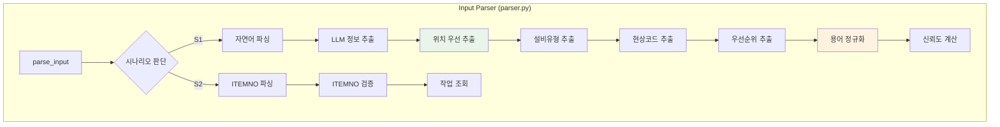

### 2. LLM Normalizer 모듈

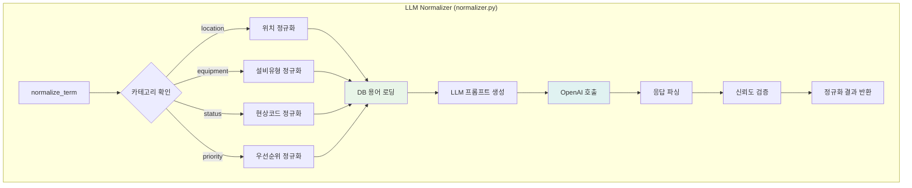

### 3. Recommendation Engine 모듈

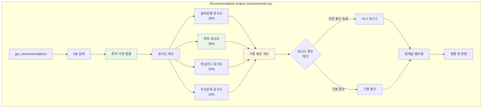

### 4. Database Manager 모듈

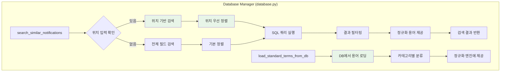

## 🔗 모듈 간 연계 다이어그램

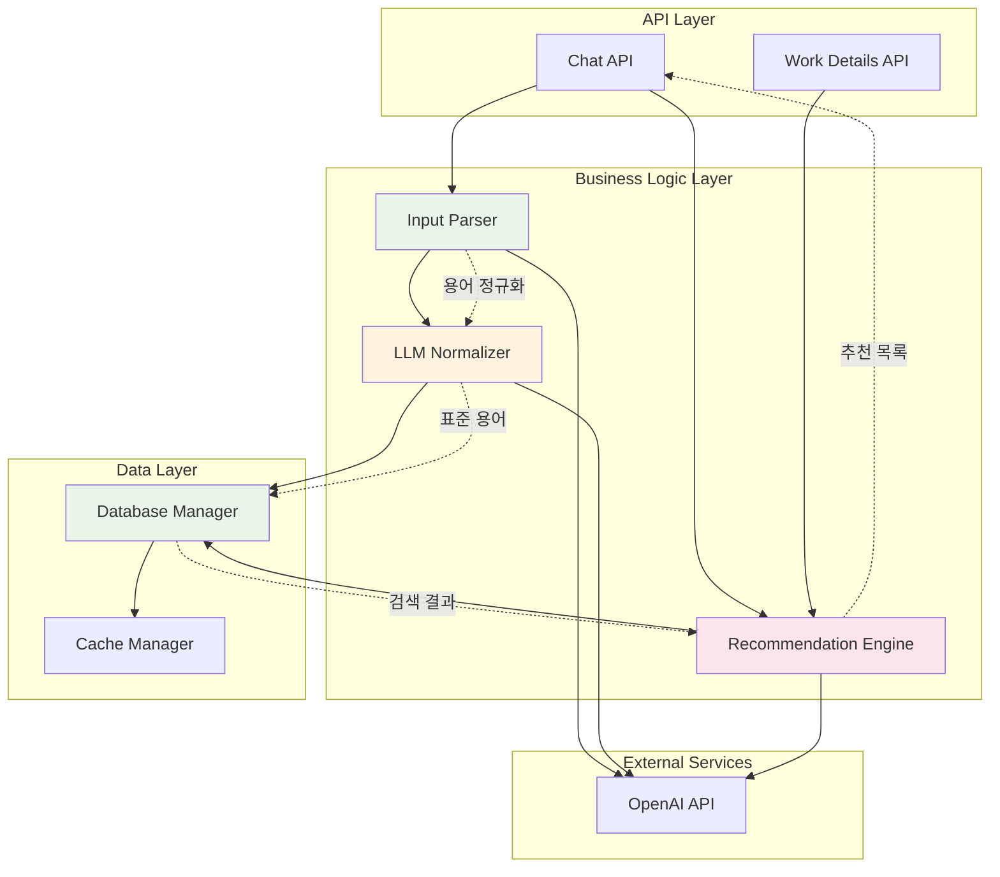

## 📊 데이터 흐름 다이어그램

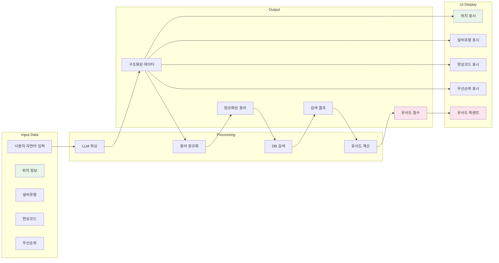

## 🎯 핵심 개선사항 아키텍처

### 1. 위치 기반 검색 강화

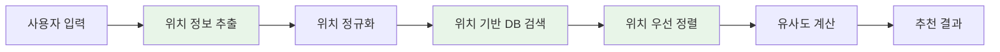

### 2. 동적 정규화 시스템

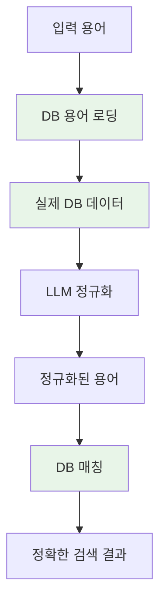

### 3. 개선된 유사도 계산

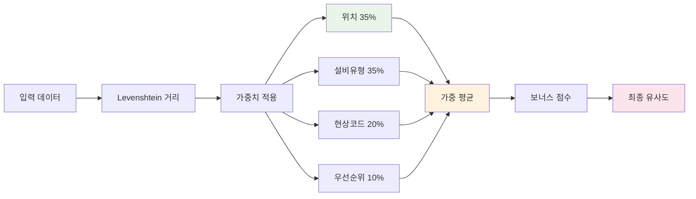

## 🔧 기술 스택 아키텍처

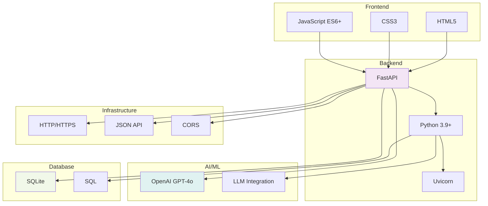

## 📈 성능 최적화 아키텍처

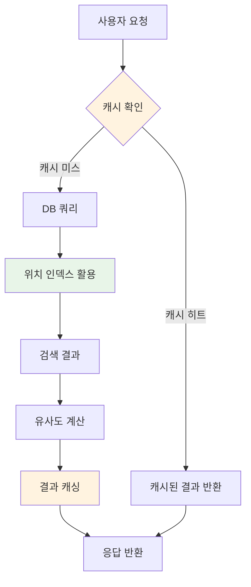

이 문서는 PMark2 시스템의 전체 아키텍처와 모듈별 작동 흐름을 시각적으로 설명합니다. 각 다이어그램은 코드의 변화를 반영하여 자동으로 업데이트되도록 설계되었습니다. 